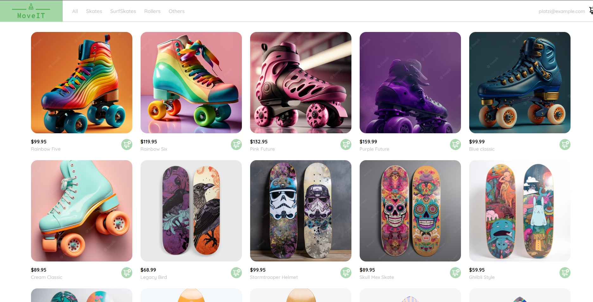
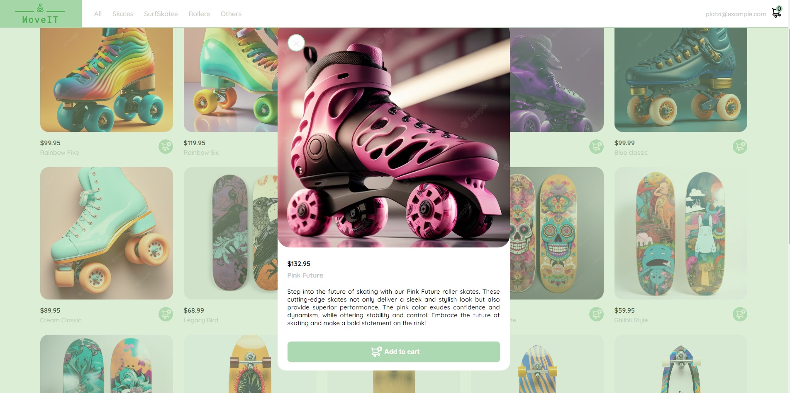
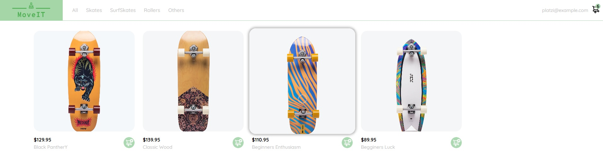

# E-commerce User Interface - LINK: https://mgn3.github.io/project-frontend-developer-js/
> [!IMPORTANT]
> The branch with the work of the previous 2 months is: refactoring/mainJavaScritpFile

This is the main frontend project I have worked on. It started as a fork from a Platzi course and every day it gets new changes, features and improvements.
I made several changes by now and I mainly work in this proyect alongside the a backend **ASP.NET Core MVC** API to create new features.

### Preview(many changes found in the other branch): https://mgn3.github.io/project-frontend-developer-js/

### Stack
- HTML5
- CSS3
- Vanilla JavaScript

## Conclusions
There are many things I have learned about the frontend. I think that the complexity of modern responsive User Interfaces is greater than what is usually believed, where many different components are interconnected.

## Screenshots:
### Main view
The header allows filtering by product type. It also contains the cart summary and an account button.
An array of products converted into individual cards.

### Modals
Every product hast it's own modal card. 

### Details
THis screenshot shows the SurfSkate category and the hover effect in the card. The cart icon on the top right shows the amount of products added.

